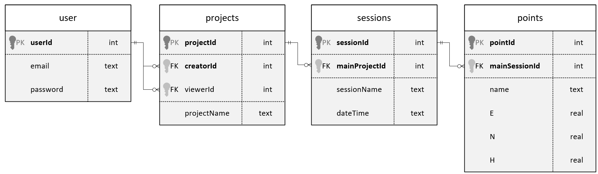

[Gehe zurück zur Hauptseite.](index.html)

# Architektur

Die Web-App DEFVIS basiert auf einer Server-Client-Architektur. Die Schnittstelle zwischen dem Client (Frontend) und dem Server (backend) basiert auf FastAPI (<a href="https://fastapi.tiangolo.com/" target="_blank">fastapi.com</a>). Als Speichermedium für die Daten dient eine SQLite-Datenbank (<a href="https://www.sqlite.org/" target="_blank">www.sqlite.org</a>).

## Beschreibung der Architektur

### Daten-Upload
Nutzer und Nutzerinnen (User) unserer Web-App können eigene Punktdaten in Sessionen als _.csv-Datei_ gebündelt in die Web-App einspeisen (im Bereich [_Session erfassen_](https://fabianruefenacht.github.io/DEFVIZ/capture_session.html)). Die Datei wird anschliessend mit _Axios_ an die _FastAPI_-Schnittstelle im Backend gesendet. Das Backend erstellt in der Tabelle _Sessions_ in der Datenbank einen neuen Eintrag. Anschliessend werden die Punkte in die Tabelle _Points_ geschrieben und mit der eben erstellten Session verknüpft.

### Anzeigen von Daten
Nachdem ein Nutzer oder eine Nutzerin eingeloggt ist, wird über _Axios_ eine Anfrage an das Backend gestellt. Diese Anfrage an _FastAPI_ löst eine Funktion im Backend aus, welche alle Projekte, für welche die Person Zugriffsrechte hat, lädt. Diese Projekte werden dann von _FastAPI_ zurück an _Axios_ im Frontend gesendet. Im Frontend kann die Nutzerin oder der Nutzer anschliessen ein [Projekt auswählen](https://fabianruefenacht.github.io/DEFVIS/projektverwaltung.html). Geschieht dies, wird mit _Axios_ eine Anfrage an die _FastAPI_-Schnittstelle gesendet. Diese Anfrage löst im Backend eine Funktion aus, welche alle Punkte des Projektes gebündelt in Sessionen zurückgibt. Die Antwort wird wiederum mit _FastAPI_ zurückgesendet und von _Axios_ empfangen. Die Sessionen können nun im Frontend über das [_Drop-down-Menü_](https://fabianruefenacht.github.io/DEFVIS/projektverwaltung.html) ausgewählt werden. Sind sowohl _Nullmessung_ als auch _Folgemessung_ ausgewählt, werden die Punkte in die [Tabelle](https://fabianruefenacht.github.io/DEFVIS/current_project.html#punktinfo) am linken Bildschirmrand, die [Karte](https://fabianruefenacht.github.io/DEFVIS/current_project.html#zweid) und in die [3D-Darstellung](https://fabianruefenacht.github.io/DEFVIS/current_project.html#dreid) geladen. Über die blauen Knöpfe in der [Tabelle](https://fabianruefenacht.github.io/DEFVIS/current_project.html#punktinfo) kann die Ansicht, je nach Auswahl in der Karte oder in der 3D-Ansicht, auf den selektierten Punkt verschoben werden.

Die nachfolgende Grafik zeigt die oben beschriebene Geodateninfrastruktur schematisch auf und verweist auf die wichtigsten Komponenten der Applikation.

## Frontend

Die Umsetzung im Frontend wurde mit _next.js_ (<a href="https://nextjs.org/docs" target="_blank">nextjs.org</a>) gemacht. Als Programmiersprache im Frontend wurde _TypeScript_ (<a href="https://www.typescriptlang.org/" target="_blank">www.typescriptlang.org</a>) gewählt. TypeScript (TS) stellt im Gegensatz zu JavaScript (JS) sicher, dass die Datentypen definiert sind, was die Anwendung weniger fehleranfällig macht. Für die Darstellung im Frontend wurde auf _Tailwind_ (<a href="https://tailwindcss.com/" target="_blank">tailwindcss.com</a>) gesetzt. Tailwind ist ein CSS-Framework, welches die wichtigsten Styling-Attribute von CSS abdeckt und einwandfrei mit Next.js und TS kombinierbar ist. Die Kommunikation zum Backend wird durch _Axios_ (<a href="https://axios-http.com/docs/intro" target="_blank">axios-http.com</a>) gelöst. Die nachfolgende Auflistung zeigt die **JS\*- & **.tsx*-Dateien im Ordner *frontend/src/app\*, welche für den Client verwendet werden und ihre Funktionalitäten auf:

- **layout.tsx:** Hauptdatei, für Layout zuständig
- **page.tsx:** Hauptbildschirm, regelt, ob Benutzer / Benutzerin Zugriff auf die Applikation hat
- **components/Button.tsx:** Einheitliche Darstellung der Buttons
- **components/Detail.tsx:** Verwaltung der States und Einbindung der 3D-Darstellung
- **components/Navbar.tsx:** Serverkomponente, welche die Routen für Log-in, Registrierung und Log-out bereitstellt.
- **components/OlMap.tsx:** Darstellung der Punkte und Verschiebungen in der Karte
- **components/Settings.tsx:** Verwalten von allen Punkt-, Sessions- und Projektdaten, Einbindung der verschiedenen Ansichten
- **components/TableView.tsx:** Darstellung der Punktverschiebungen in einer Tabelle
- **components/ThreeScene.tsx:** Darstellung der Punkte auf dem 3D-Modell
- **components/cookies/cookiecreator.tsx:** Schreiben von Cookies (für Log-in benötigt)
- **components/cookies/cookiereader.tsx:** Lesen von Cookies (für Log-in benötigt)
- **components/login/page.tsx:** Einlogen von Benutzenden
- **components/logout/page.tsx:** Abmelden von Benutzenden
- **components/register/page.tsx:** Registrierung von neuen Benutzern / Benutzerinnen

## Backend

Das Backend ist in der Programmiersprache _Python_ (<a href="https://www.python.org/" target="_blank">python.org</a>) geschrieben. In der Datei _db.py_ ist eine Klasse enthalten, welche die Interaktion mit der Datenbank ermöglicht. Dafür wird die Python-Bibliothek _sqlite3_ verwendet. Total sind 15 Funktionen vorhanden. Diese sind in folgende Kategorien zu unterteilen:

- **DB erstellen:** Erstellen der Datenbank und einrichten der Tabellen
- **User:** Interaktion mit der Tabelle User (User erstellen und lesen)
- **Project:** Interaktion mit der Tabelle projects (Projekte erstellen und lesen)
- **Sessions:** Interaktion mit der Tabelle sessions (Sessionen erstellen und lesen)
- **Points:** Interaktion mit der Tabelle points (Punkte erstellen und lesen)

Die Funktionen der Datei _db.py_ werden in der Datei _main.py_ aufgerufen. Hier werden die Bibliotheken _FastAPI_, _pydantic_ und _uvicorn_ benötigt. Durch FastAPI werden sieben Routen mit den folgenden Zwecken eröffnet:

- **/user:** Benutzer erstellen
- **/login:** Log-in prüfen
- **/newProject:** Projekt erstellen
- **/openProject:** Projekte der nutzenden Person laden
- **/newSession:** Neue Session im Projekt anlegen
- **/getSessions:** Vorhandene Sessionen im Projekt anzeigen & Punkte beziehen

## Datenbank

In der Datenbank wurden vier Tabellen erstellt, welche die Nutzer und deren Projekte verwalten. Die Tabellen sind:

- **user**
- **projects**
- **sessions**
- **points**
 
In diesen vier Tabellen werden alle nötigen Informationen gespeichert. Die Integrität der Daten wird durch Python im backend sichergestellt und durch entsprechende Fehlermeldungen im frontend den Nutzenden mitgeteilt. In der anschliessenden Grafik ist das Datenbankschema ersichtlich. Die **fett** geschriebenen Attribute sind gemeinsam, eindeutig.

---

[Zurück nach ganz oben.](architecture.html)
