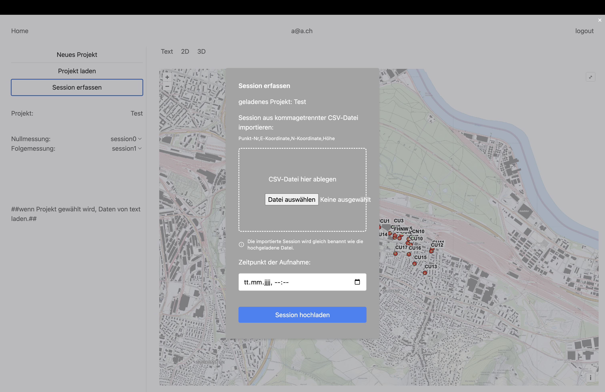

# Session erfassen

## Probleme und Verbesserungsvorschläge

- Das Tool funktioniert noch nicht und es wäre schön, wenn eine Drag-and-Drop-Funktion implementiert würde.
- Der Text im Fenster ragt heraus, möglicherweise könnte die Fenstergrösse verbreitert oder der Text verkleinert werden, um dies zu beheben.
- Es gibt keine Möglichkeit, das Fenster einfach zu schliessen. Ein deutlicherer Schliessen-Button, vielleicht oben rechts platziert, könnte die Benutzerfreundlichkeit verbessern.
