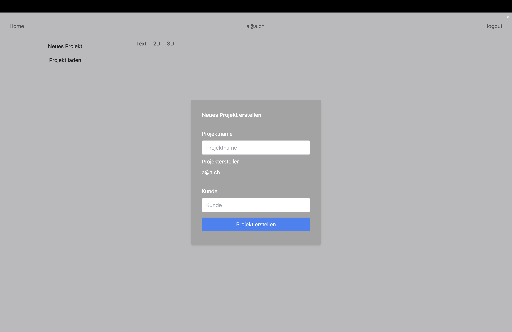

# Projekt erstellen

## Probleme und Verbesserungsvorschläge

- Es fehlt eine Erklärung, was ein "Kunde" ist und warum es abgefüllt werden muss. Auch wird nicht klar kommuniziert, dass ein "@"-Zeichen für die E-Mail-Adresse verwendet werden sollte.
- Es wird nicht deutlich gemacht, was passiert, wenn ein Projekt mit demselben Namen erstellt wird.
- Eine Möglichkeit, die Datenformatierung zu erklären, könnte sinnvoll sein. Zum Beispiel könnte unter dem Eingabefeld ein grauer Beispieltext stehen, wie "20240430_Musterprojekt", "musterkunde@a.ch".
- Es gibt keine Möglichkeit, das Fenster einfach zu schliessen. Ein deutlicherer Schliessen-Button, vielleicht oben rechts platziert, könnte die Benutzerfreundlichkeit verbessern.
