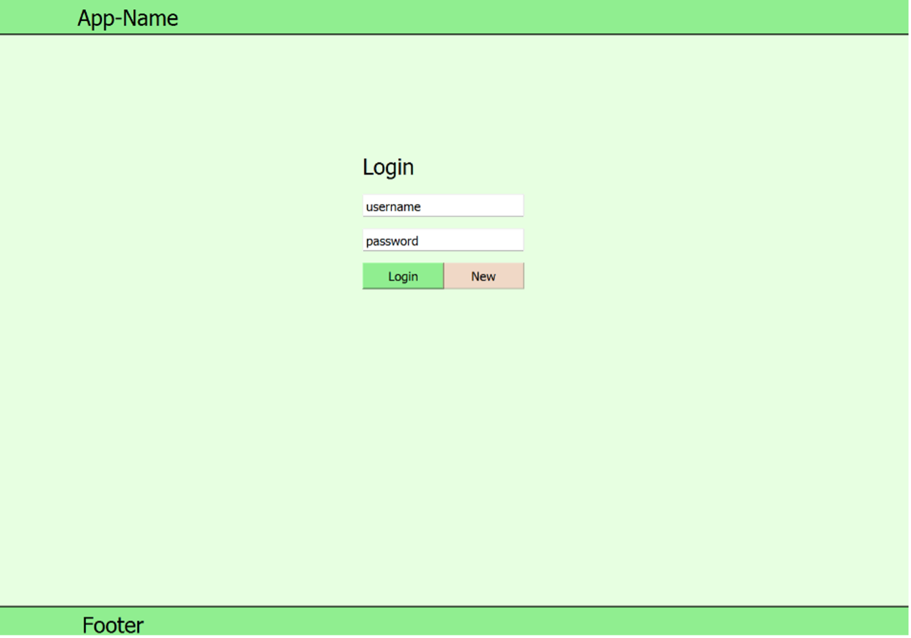
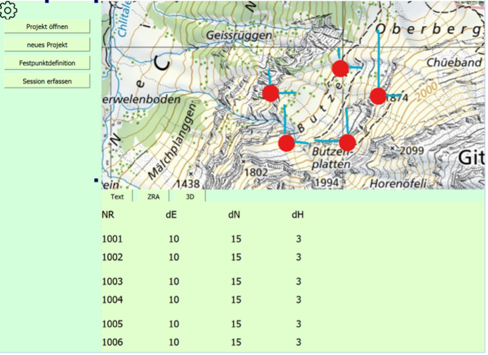
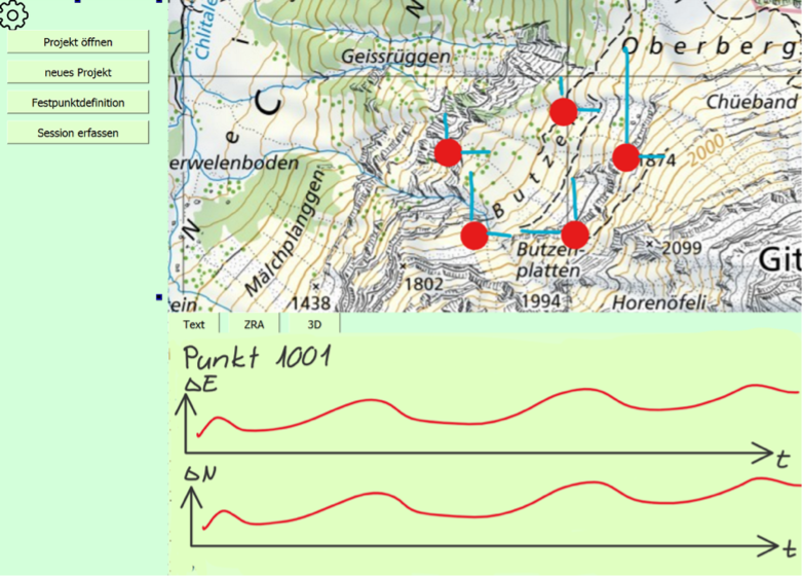
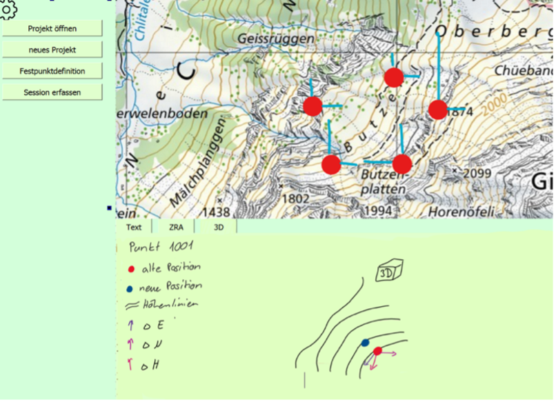
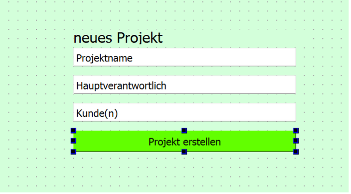
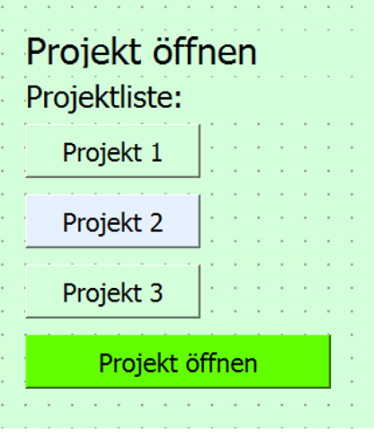
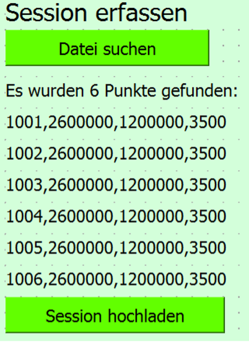
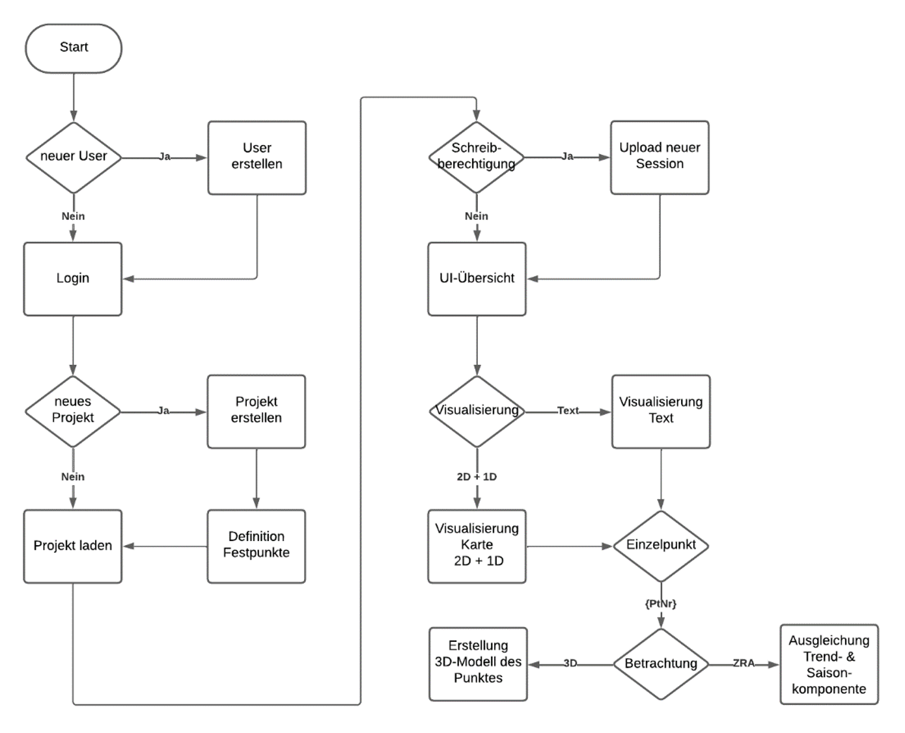
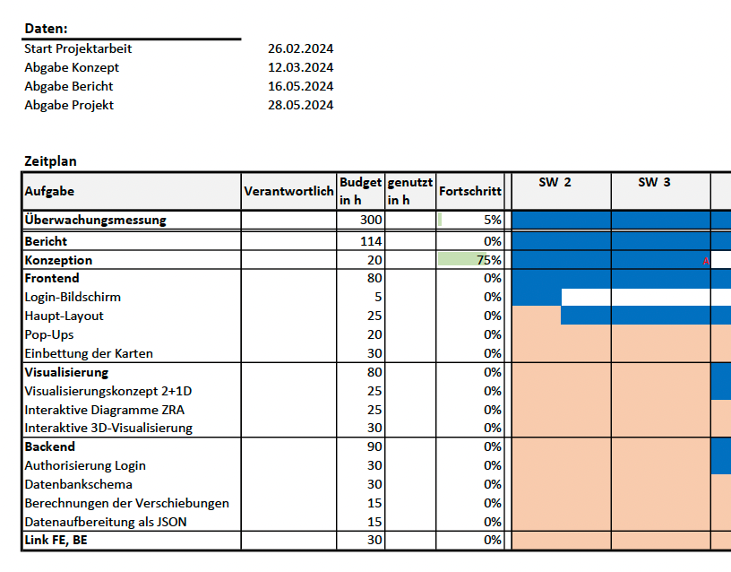

[Gehe zurück zur Hauptseite](index.html)

# Konzept von DEFVIS

## 3D-Visualisierung von definierten Vektoren in einem WebGIS

### Projektarbeit im Vertiefungsprofil Geoinformatik und Raumanalyse

Fabian Rüfenacht  
Lucas Wunderli  
Nathan Matzinger

Muttenz, 12.03.2024

**Inhaltsverzeichnis**

<li><a href="https://fabianruefenacht.github.io/6230_FRNMLW/drafts.html/#einleitung">1 Einleitung</a></li>
<li><a href="https://fabianruefenacht.github.io/6230_FRNMLW/drafts.html/#projektinhalt">2 Projektinhalt</a></li>
<li><a href="https://fabianruefenacht.github.io/6230_FRNMLW/drafts.html/#zielsetzung">3 Zielsetzung</a></li>
<li><a href="https://fabianruefenacht.github.io/6230_FRNMLW/drafts.html/#fragestellung">4 Fragestellung</a></li>
<li><a href="https://fabianruefenacht.github.io/6230_FRNMLW/drafts.html/#anwendungsarchitektur">5 Anwendungsarchitektur</a></li>
<li><a href="https://fabianruefenacht.github.io/6230_FRNMLW/drafts.html/#frontend">5.1 Frontend</a></li>
<li><a href="https://fabianruefenacht.github.io/6230_FRNMLW/drafts.html/#backend">5.2 Backend</a></li>
<li><a href="https://fabianruefenacht.github.io/6230_FRNMLW/drafts.html/#umsetzung">5.3 Umsetzung</a></li>
<li><a href="https://fabianruefenacht.github.io/6230_FRNMLW/drafts.html/#mockup">6 Mockup- und GUI-Aufbau</a></li>
<li><a href="https://fabianruefenacht.github.io/6230_FRNMLW/drafts.html/#popups">6.1 Pop-Ups</a></li>
<li><a href="https://fabianruefenacht.github.io/6230_FRNMLW/drafts.html/#flussdiagramm">7 Flussdiagramm der Funktionalitäten</a></li>
<li><a href="https://fabianruefenacht.github.io/6230_FRNMLW/drafts.html/#userpersona">8 User Persona</a></li>
<li><a href="https://fabianruefenacht.github.io/6230_FRNMLW/drafts.html/#userpersona_1">8.1 User Persona 1: Max Muster</a></li>
<li><a href="https://fabianruefenacht.github.io/6230_FRNMLW/drafts.html/#userpersona_2">8.2 User Persona 2: Melanie Muster</a></li>
<li><a href="https://fabianruefenacht.github.io/6230_FRNMLW/drafts.html/#geodatensaetze">9 Geodatensätze</a></li>
<li><a href="https://fabianruefenacht.github.io/6230_FRNMLW/drafts.html/#metadaten_dok">10 Metadaten und Dokumentation Geodatensätze</a></li>
<li><a href="https://fabianruefenacht.github.io/6230_FRNMLW/drafts.html/#metadaten">10.1 Metadaten</a></li>
<li><a href="https://fabianruefenacht.github.io/6230_FRNMLW/drafts.html/#dokumentation">10.2 Dokumentation</a></li>
<li><a href="https://fabianruefenacht.github.io/6230_FRNMLW/drafts.html/#aufgaben_zeit">11 Aufgaben und Zeitaufwand</a></li>
<li><a href="https://fabianruefenacht.github.io/6230_FRNMLW/drafts.html/#planung">11.1 Planung der Tasks</a></li>
<li><a href="https://fabianruefenacht.github.io/6230_FRNMLW/drafts.html/#zeitplanung">11.2 Zeitplanung</a></li>
<li><a href="https://fabianruefenacht.github.io/6230_FRNMLW/drafts.html/#literatur">12 Literatur</a></li>
<li><a href="https://fabianruefenacht.github.io/6230_FRNMLW/drafts.html/#abbildung_tab">13 Abbildungen und Tabellen</a></li>
<li><a href="https://fabianruefenacht.github.io/6230_FRNMLW/drafts.html/#abbildung">13.1 Abbildungen</a></li>
<li><a href="https://fabianruefenacht.github.io/6230_FRNMLW/drafts.html/#tabellen">13.2 Tabellen</a></li>

# 1 Einleitung {#einleitung}

Dieses Konzept beschäftigt sich mit der Entwicklung einer Geodateninfrastruktur durch Geomatikstudierende an der Fachhochschule Nordwestschweiz. Ziel ist die Visualisierung von dreidimensionalen Verschiebungsvektoren in einem WebGIS. Im Backend soll die nutzerabhängige Speicherung verschiedener Messsessionen und die Berechnung der Verschiebungen möglich sein. Das Projekt wird durch Coaching und Peer-Learning unterstützt.

# 2 Projektinhalt {#projektinhalt}

Dieses Projekt konzentriert sich auf die Entwicklung einer benutzerfreundlichen WebGIS-Umgebung, die es den Nutzenden ermöglicht, Geodaten effizient zu verwalten, zu visualisieren und zu analysieren. Die Hauptfunktionen umfassen die Erstellung und Verwaltung von Projekten sowie die Integration von Punkten und Messungen in diese Projekte.

Benutzer und Benutzerinnen haben die Möglichkeit, verschiedene Arten von Daten in die Plattform zu importieren und diese dann auf einer interaktiven Karte anzeigen zu lassen. Darüber hinaus wird ein 3D-Viewer integriert, um eine immersive Visualisierung von geografischen Informationen zu ermöglichen.

Ein wesentlicher Aspekt des Projekts ist die Unterstützung von Überwachungsaufgaben, beispielsweise für Bauwerke wie Staumauern. Durch die Integration von mehreren Messungen können Anwendende die Entwicklung und Veränderung der Überwachungsdaten über die Zeit hinweg verfolgen. Dies wird durch die Darstellung der Daten mit Hilfe von Zeitreihenanalysen (ZRA) oder Vektoren in der WebGIS-Umgebung erleichtert.

Folgende URL führt zum Projekt: <a href="https://github.com/FabianRuefenacht/6230_FRNMLW">https://github.com/FabianRuefenacht/6230_FRNMLW</a>

# 3 Zielsetzung {#zielsetzung}

Das Hauptziel der Geodateninfrastruktur besteht darin, Deformationsmessungen zu verwalten und dreidimensionale Verschiebungen zu visualisieren, um eine wirkungsvolle Überwachung und Analyse von geophysikalischen Veränderungen in Echtzeit zu ermöglichen. Die Darstellung dieser Daten im dreidimensionalen Kontext bietet den Nutzern und Nutzerinnen eine intuitive und umfassende Sicht auf die Daten, was zu fundierteren und informierteren Entscheidungen führt.

Die Implementierung dieser Funktionen zielt darauf ab, eine effiziente und effektive Datenanalyse sowie eine ansprechende Visualisierung zu ermöglichen, wodurch die Anwendung eine breite Palette von Anwendungsgebieten abdecken kann, von Infrastrukturüberwachung bis hin zu Umweltmanagement.

# 4 Fragestellung {#fragestellung}

Die zentrale Frage dieses Projekts lautet: Wie können Punktverschiebungen effektiv dreidimensional visualisiert werden, um die Analyse und Interpretation von Bewegungs- und Verformungsmustern zu erleichtern und zu verbessern? Dabei ist es von entscheidender Bedeutung, geeignete Techniken und Methoden zu identifizieren, die eine detaillierte, präzise und benutzerfreundliche Darstellung ermöglichen.

Diese Fragestellung zielt darauf ab, die Herausforderungen bei der Visualisierung von raumbezogenen Daten zu adressieren und Lösungen zu entwickeln, die es den Benutzenden ermöglichen, komplexe geophysikalische Veränderungen besser zu verstehen und fundiertere Entscheidungen zu treffen.

Indem diese Fragestellung näher untersucht wird, sollen nicht nur die technischen Aspekte der Visualisierung von Punktverschiebungen berücksichtigt werden, sondern auch die Bedürfnisse und Anforderungen der Benutzer im Hinblick auf die Benutzerfreundlichkeit der dargestellten Informationen.

# 5 Anwendungsarchitektur {#anwendungsarchitektur}

Die Anwendungsarchitektur beschreibt die Struktur und Organisation der Softwareanwendung, einschliesslich der Patterns, Techniken und Komponenten, die bei der Entwicklung verwendet werden.

Diese klar strukturierte Architektur ermöglicht eine nahtlose Integration von Frontend und Backend, um eine leistungsstarke und benutzerfreundliche WebGIS-Anwendung zu schaffen.

## 5.1 Frontend {#frontend}

Das Frontend des WebGIS bietet eine Vielzahl von Funktionalitäten, die es den Benutzern und Benutzerinnen ermöglichen, Geodaten intuitiv zu verwalten, zu visualisieren und zu analysieren:

- **Login:** Benutzer und Benutzerinnen können sich sicher anmelden, um auf das WebGIS zuzugreifen.
- **Projektverwaltung:** Projekte können erstellt, bearbeitet und gelöscht werden, um die Arbeit zu organisieren.
- **Zeitstände (Sessions) verwalten:** Zeitstände ermöglichen es, Daten zu verschiedenen Zeitpunkten zu speichern und zu vergleichen.
- **Upload von ASCII-Daten mit Punktdaten:** Benutzer und Benutzerinnen können einfach ASCII-Dateien mit Punktinformationen hochladen, um ihre Daten zu importieren.
- **Laden von Hintergrundkarten:** Verschiedene Hintergrundkarten stehen zur Verfügung, um den Kontext für die Visualisierung der Daten zu bieten.
- **Zweidimensionale Darstellung der Verschiebungen:** Die Verschiebungen können in einer übersichtlichen zweidimensionalen Ansicht betrachtet werden.
- **Dreidimensionale Darstellung der Verschiebungen:** Eine immersive 3D-Visualisierung ermöglicht es, die Verschiebungen räumlich zu erkunden.
- **Visualisierung von Saison- und Trendkomponenten:** Trend- und Saisonkomponenten können geschätzt werden, um die Verschiebungen zu beurteilen.

## 5.2 Backend {#backend}

Das Backend des WebGIS bietet die notwendige Infrastruktur und Logik, um die Funktionalitäten des Frontends zu unterstützen:

- **Benutzerverwaltung in der Datenbank:** Benutzerinformationen werden sicher in einer Datenbank gespeichert und verwaltet.
- **Projektverwaltung in der Datenbank:** Projektdaten werden strukturiert in einer Datenbank gespeichert und verwaltet.
- **Zeitstände (Sessions) in der Datenbank speichern:** Zeitstände werden in der Datenbank gespeichert, um den Vergleich von Daten zu verschiedenen Zeitpunkten zu ermöglichen.
- **Punktdatenverwaltung in der Datenbank:** Die relevanten Punktdaten werden in einer Datenbank gespeichert und effizient verwaltet.
- **Verarbeitung von ASCII-Daten:** Die Verarbeitung von ASCII-Daten ermöglicht es, relevante Informationen aus den hochgeladenen Dateien zu extrahieren und zu speichern.
- **Bezug von Oberflächenmodellen für die 3D-Visualisierung:** Oberflächenmodelle dienen als räumlichen Kontext für die Darstellung der Verschiebungen in der 3D-Umgebung.
- **Berechnung der Verschiebungen zwischen zwei Zeitständen:** Die benötigten Berechnungen für die Analyse von Verschiebungen werden im Backend durchgeführt.
- **Ausgleichung der Saison- und Trendkomponenten:** Saisonale und trendbezogene Komponenten werden analysiert und ausgeglichen, um genaue Ergebnisse zu erzielen.

## 5.3 Umsetzung {#umsetzung}

Das Frontend wird mit dem JavaScript-Framework Next.js gemacht. Next.js bietet die Unterstützung des serverseitigen Renderings. Somit lassen sich Cookies leicht erstellen und abfragen, was die Zugriffsberechtigung zu einzelnen Projekten erleichtert. Im Frontend wird die Programmiersprache TypeScript verwendet. Gegenüber JavaScript ermöglicht TypeScript die Definition von Datentypen, was die Stabilität des WebGIS erhöht. Die Darstellung des User Interface wird mit Tailwind CSS gemacht. Die Zugriffsberechtigung wird mit Cookies geregelt. Die Cookies werden mit bcrypt.js erstellt. Vom Backend werden die Anforderungen an das Cookie gesendet. Im Frontend wird geprüft, ob das Cookie den Anforderungen entspricht.

Die Darstellung der Punkte und Verschiebungen wird mit einer JavaScript-Bibliothek realisiert. Dafür kommen derzeit die Bibliotheken OpenLayers und Leaflet in Frage. Im Laufe der Umsetzung gilt zu klären, welche Bibliothek sich am besten eignet.

Die Visualisierung der dreidimensionalen Verschiebung soll ebenfalls über eine JavaScript-Bibliothek erfolgen. Derzeit ist noch nicht geklärt, welche Bibliotheken sich dafür eignen. Gleiches gilt für die Visualisierung der Zeitreihen.

Die Kommunikation zwischen Fronend und Backend wird durch FastAPI geführt. Die Typendefinition der ein- und ausgehenden JSON-Formate wird mit pydantic geregelt, um semantische Richtigkeit zu gewährleisten.

Für die Verwaltung von Nutzerprofilen, Projekten, Sessionen und Punkten wird auf eine SQLite-Datenbank gesetzt. SQLite ist eine schlanke Datenbank mit wenigen Funktionen. Dadurch ist sie schnell und leistungsstark. Aufgrund der geringen Menge an Geodaten kann auf eine räumliche Datenbankstruktur verzichtet werden.

Die Berechnungen im Backend werden von Grund auf selbst programmiert und durch die Verwendung von Numpy auf die höchstmögliche Effizienz gehoben.

# 6 Mockup- und GUI-Aufbau {#mockup}

Der Mockup- und GUI-Aufbau skizziert die Benutzeroberfläche der Anwendung, einschliesslich der verschiedenen Fenster und PopUps. Das Styling der Komponenten wird im Endprodukt überarbeitet.

_Login-Fenster_

Das Login-Fenster ermöglicht Nutzenden, sich anzumelden oder neu zu registrieren (siehe Abbildung 1 Login-Fenster Button „New“). Fehlerhafte Anmeldeinformationen oder eine fehlende Registrierung werden durch entsprechende Meldungen signalisiert.

| Abbildung 1 Login-Fenster                                                                                                                      |
| ---------------------------------------------------------------------------------------------------------------------------------------------- |
|  |
| Quelle: Screenshot vom 02. März 2024 aus QT-Designer                                                                                           |

_Main-Fenster_

Das Hauptfenster (Main-Fenster) präsentiert die Hauptansicht der Anwendung mit einer anpassbaren Hintergrundkarte. Links davon befindet sich das Registermenü, darunter sind Funktionen angeordnet, die es Benutzern ermöglichen, verschiedene Informationen aufzurufen. Standardmässig werden Informationen zu den Punkten des Projekts angezeigt.

| Abbildung 2 Main-Fenster                                                                                                                          |
| ------------------------------------------------------------------------------------------------------------------------------------------------- |
|  |
| Quelle: Screenshot vom 02. März 2024 aus QT-Designer                                                                                              |

_Zeitreihenanalyse_

Durch Klicken auf den „ZRA“-Button wird eine Analyse der Zeitreihen für die Punkte im Projekt angezeigt.

| Abbildung 3 Zeitreihenanalyse                                                                                                                    |
| ------------------------------------------------------------------------------------------------------------------------------------------------ |
|  |
| Quelle: Screenshot vom 02. März 2024 aus QT-Designer                                                                                             |

_3D-Fenster_

Der „3D“-Button öffnet das 3D-Fenster, in dem die Punkte und Vektoren dreidimensional visualisiert werden.

| Abbildung 4 3D-Fenster                                                                                                                         |
| ---------------------------------------------------------------------------------------------------------------------------------------------- |
|  |
| Quelle: Screenshot vom 02. März 2024 aus QT-Designer                                                                                           |

## 6.1 Pop-Ups {#popups}

_Neues Projekt_

Das Pop-Up „Neues Projekt“ ermöglicht es Benutzenden, ein neues Projekt zu erstellen, indem sie Projektname, die oder den Hauptverantwortliche/n und Kundeninformationen eingeben und dann auf „Projekt erstellen“ klicken.

| Abbildung 5 neues Projekt                                                                                                                    |
| -------------------------------------------------------------------------------------------------------------------------------------------- |
|  |
| Quelle: Screenshot vom 02. März 2024 aus QT-Designer                                                                                         |

_Projekteröffnung_

In diesem Pop-Up werden alle vorhandenen Projekte aufgelistet. Nutzende können ein Projekt auswählen und durch Klicken auf „Projekt öffnen“ laden.

| Abbildung 6 Projekteröffnung                                                                                                                   |
| ---------------------------------------------------------------------------------------------------------------------------------------------- |
|  |
| Quelle: Screenshot vom 02. März 2024 aus QT-Designer                                                                                           |

_Datei hochladen_

Das Pop-up „Datei hochladen“ dient zum Hochladen von Dateien.

| Abbildung 7 Datei hochladen                                                                                                                     |
| ----------------------------------------------------------------------------------------------------------------------------------------------- |
|  |
| Quelle: Screenshot vom 02. März 2024 aus QT-Designer                                                                                            |

# 7 Flussdiagramm der Funktionalitäten {#flussdiagramm}

Das Flussdiagramm veranschaulicht den sequenziellen Ablauf der wichtigsten Funktionen und Interaktionen in der Anwendung. Es bietet einen klaren Überblick über die verschiedenen Schritte, die Benutzer und Benutzerinnen durchlaufen, und zeigt, wie die einzelnen Komponenten miteinander verbunden sind.

| Abbildung 8 Flussdiagramm                                                                                                                      |
| ---------------------------------------------------------------------------------------------------------------------------------------------- |
|  |
| Quelle: Screenshot vom 02. März 2024 aus OneNote                                                                                               |

# 8 User Persona {#userpersona}

Dieses Kapitel stellt zwei typische Benutzerprofile (User Persona) vor, beschreibt ihre Nutzung der Webanwendung und beschreibt mögliche inkorrekte Interaktionen.

## 8.1 User Persona 1: Max Muster {#userpersona_1}

**Beschreibung:**

- Name: Max Muster
- Alter: 25 Jahre
- Beruf: Geomatikingenieur
- Max arbeitet für ein Ingenieurbüro und ist spezialisiert auf die Überwachung von Deformationsmessungen in geodätischen Netzen.
- Neben seiner Arbeit im Büro präsentiert Max die Ergebnisse seiner Analysen oft direkt vor Ort beim Kunden.

**Nutzung der Webanwendung durch Max:**

- Max verwendet die Webanwendung, um Geländeverschiebungen zu visualisieren, zu analysieren und zu präsentieren.
- Er erstellt Projekte, fügt Messpunkte hinzu und überprüft die Verschiebungen im Gelände.

**Mögliche inkorrekte Interaktionen:**

- Aufgrund der Komplexität einiger Funktionen könnte Max Probleme bei der korrekten Interpretation der Ergebnisse haben, insbesondere wenn es um die Analyse von saisonalen Schwankungen geht.
- Möglicherweise hat Max Schwierigkeiten beim Hochladen grösserer Datenmengen und benötigt klare Anweisungen zur Optimierung der Dateigrösse.
- Max könnte Sessionen dem falschen Projekt zuordnen. Er muss sorgfältig sein.
- Er könnte denselben Sessionsnamen mehrfach im Projekt verwenden was zu Ambiguitäten führt. Dies wird durch das Datenbankschema abgefangen und durch eine entsprechende Fehlermeldung im Frontend angezeigt.
- Bei der Projekterstellung könnte Max mehrere Projekte mit gleicher Namensgebung erstellen oder einen unbekannten Nutzer als Betrachter hinzufügen. Beide Fehler werden durch das Datenbankschema abgefangen und im Frontend durch eine Fehlermeldung kommuniziert.

## 8.2 User Persona 2: Melanie Muster {#userpersona_2}

**Beschreibung:**

- Name: Melanie Muster
- Alter: 30 Jahre
- Beruf: Geologin
- Melanie arbeitet für ein Unternehmen, das sich auf geologische Untersuchungen spezialisiert hat.
- Sie nutzt die Webanwendung, um Bewegungen im Gelände zu überwachen und zu analysieren, insbesondere im Bereich von Wasserbauwerken wie Staumauern.

**Nutzung der Webanwendung durch Melanie:**

- Melanie verwendet die Webanwendung, um geologische Verschiebungen zu überwachen und zu analysieren, wobei sie sich besonders für die dreidimensionale Visualisierung interessiert.
- Sie extrahiert relevante Informationen aus den dargestellten Daten, um auf mögliche Risiken im Zusammenhang mit Geländeverschiebungen hinzuweisen.
- Da ihre Kenntnisse über Dateiformate und Datenerhebungen beschränkt sind, erstellt sie keine Projekte und ist auf die einwandfreie Visualisierung des Geomatikingenieurs / der Geomatikingenieurin angewiesen. Um sich nicht bei jedem Projekt in ein neues Visualisierungskonzept eindenken zu müssen, bevorzugt sie die Visualisierung in einer standardisierten Umgebung.

**Mögliche inkorrekte Interaktionen:**

- Melanie könnte Schwierigkeiten haben, komplexe Analysefunktionen effektiv zu nutzen, insbesondere wenn es um die Interpretation von Trendkomponenten geht. Ein Link zu einer Website, welche die Analyse von Zeitreihen beschreibt, könnte ihr bei der Beurteilung helfen.
- Es ist möglich, dass Melanie aufgrund von unklaren Anweisungen oder einer überladenen Benutzeroberfläche Schwierigkeiten hat, die benötigten Daten zu identifizieren und zu extrahieren. So soll das UI möglichst einfach sein und den Benutzer / die Benutzerin durch intelligentes Ein- und Ausblenden von Funktionalitäten durch den Prozess der Analyse führen.

# 9 Geodatensätze {#geodatensaetze}

Die, in der Webanwendung verwendeten Geodaten, umfassen verschiedene Quellen:

**User-generierte Daten:**

- Verschiedene Sessionen der Überwachungsmessung im aktuellen Landeskoordinatensystem der Schweiz (LV95) werden von der nutzenden Person bereitgestellt. Durch die Transformations-API von Swisstopo werden die Daten so aufbereitet, dass sie auf einer Karte dargestellt werden können. Diese Daten dienen dazu, präzise Messungen und Verschiebungen im Gelände zu erfassen und zu visualisieren.

**OpenData:**

- Web Map Service (WMS) von Swisstopo wird genutzt, um die Landeskarte als Hintergrundkarte in der Anwendung anzuzeigen. Diese Karten bieten eine detaillierte Ansicht der geografischen Umgebung und dienen als Kontext für die Visualisierung der Verschiebungen.
- Ebenso werden WMS-Dienste von Swisstopo für Orthophotos verwendet, um hochauflösende Luftbilder bereitzustellen. Diese dienen dazu, einen noch besseren Überblick über die Daten zu erhalten.
- Die Webanwendung integriert XYZ-Tiles von OpenStreetMap (OSM), um zusätzliche Kartendetails und geografische Informationen bereitzustellen.
- SwissSURFACE3D-Daten werden verwendet, um dreidimensionale Geländemodelle zu generieren. Diese Daten tragen zur Darstellung von Geländeoberflächen und zur räumlichen Visualisierung der Verschiebungen bei.

Durch die Kombination dieser verschiedenen Geodatensätze bietet die Webanwendung eine umfassende und detaillierte Darstellung der geografischen Umgebung und der durchgeführten Messungen.

# 10 Metadaten und Dokumentation {#metadaten_dok}

## 10.1 Metadaten {#metadaten}

Die Punktdaten/Sessionen, welche vom Projektersteller/der Projekterstellerin bereitgestellt werden, haben die Attribute Punktnummer, Ost-Wert, Nord-Wert, Höhe und Zeitstempel. Der Zeitstempel wird für die Zeitreihenanalyse benötigt.

Die Landeskarte und das Orthophoto wird direkt als WMS-Dienst von der Swisstopo eingebunden. Der WMS-Dienst verfügt über den GetMap-Aufruf. Damit kann die gewünschte Karte abgerufen werden. (swisstopo 2021)

Die Hintergrundkarte von OpenStreetMap kann über XYZ-Tiles bezogen werden.

SwissSURFACE3D ist ein Höhenmodell der Swisstopo. Es können Kacheln mit der Ausdehnung 1 km2 bezogen werden. Der Inhalt der Kacheln ist eine klassierte Punktwolke. (swisstopo 2024).

## 10.2 Dokumentation {#dokumentation}

Eine umfassende Dokumentation des WebGIS’, wird mit Hilfe von GitBooks erstellt.

GitBook ist eine Plattform zum Erstellen, Bearbeiten und Veröffentlichen von Büchern und technischer Dokumentation. Mit Markdown geschriebene Inhalte können in verschiedenen Formaten exportiert werden.

# 11 Aufgaben und Zeitaufwand {#aufgaben}

In diesem Abschnitt werden die einzelnen Aufgaben, der geschätzte Zeitaufwand und der Zeitplan für die Umsetzung des Projekts dargestellt.

## 11.1 Planung der Tasks {#planung}

Tabelle 1 Zeitaufwand

| Task                                | Beschreibung                                                        | Geschätzter Zeitaufwand (Stunden) |
| ----------------------------------- | ------------------------------------------------------------------- | --------------------------------- |
| Login-Bildschirm                    | Implementierung des Anmelde- und Registrierungsformulars            | 5                                 |
| Grundgerüst der Website (Layout)    | Entwicklung des grundlegenden Layouts der Webanwendung              | 8                                 |
| Einbettung der Karten               | Integration von Karten-APIs für die Anzeige von Geodaten            | 10                                |
| Interaktive Diagramme für ZRA       | Entwicklung von interaktiven Diagrammen für die Zeitreihenanalyse   | 20                                |
| Interaktive 3D-Visualisierungen     | Implementierung interaktiver 3D-Visualisierungen der Verschiebungen | 20                                |
| Visualisierungskonzept für 2+1D     | Konzeption und Umsetzung einer Visualisierung für 2+1D-Daten        | 10                                |
| Autorisierung Login                 | Einrichtung von Benutzerkonten und Authentifizierungssystem         | 20                                |
| Berechnungen                        | Implementierung der erforderlichen Berechnungen und Algorithmen     | 15                                |
| Datenbankschema                     | Entwurf und Implementierung des Datenbankschemas                    | 10                                |
| Datenaufbereitung JSON              | Vorbereitung und Formatierung von Daten im JSON-Format              | 20                                |
| Zusammenführen Frontend und Backend | Integration und Abstimmung von Frontend- und Backend-Entwicklungen  | 20                                |

Quelle: private Ablage

## [11.2 Zeitplanung] {#zeitplanung}

| Abbildung 9 Auszug aus dem Zeitplan                                                                                                   |
| ------------------------------------------------------------------------------------------------------------------------------------- |
|  |
| Quelle: Screenshot vom 05. März 2024 aus Exceltabelle Zeitplan.xlsx                                                                   |

Siehe kompletter Zeitplan im Anhang: Zeitplan.pdf, Stand vom 12. März 2024

# 12 Literatur {#literatur}

swisstopo (2021) Web Map Tiling Services WMTS: Verfügbare Dienste und Daten. Verfügbar über: <https://www.geo.admin.ch/de/wmts-verfuegbare-dienste-und-daten/> (Letzter Zugriff: 11.03.2024).

swisstopo (2024) swissSURFACE3D. Verfügbar über: <https://www.swisstopo.admin.ch/de/hoehenmodell-swisssurface3d> (Letzter Zugriff: 11.03.2024).

# 13 Abbildungen und Tabellen (#abbildungen_tab)

## Abbildungen (#abbildungen)

[Abbildung 1 Login-Fenster 5](#_Toc161149727)

[Abbildung 2 Main-Fenster 6](#_Toc161149728)

[Abbildung 3 Zeitreihenanalyse 6](#_Toc161149729)

[Abbildung 4 3D-Fenster 7](#_Toc161149730)

[Abbildung 5 neues Projekt 7](#_Toc161149731)

[Abbildung 6 Projekteröffnung 8](#_Toc161149732)

[Abbildung 7 Datei hochladen 8](#_Toc161149733)

[Abbildung 8 Flussdiagramm 9](#_Toc161149734)

[Abbildung 9 Auszug aus dem Zeitplan 14](#_Toc161149735)

## Tabellen (#tabellen)

[Tabelle 1 Zeitaufwand 12](#_Toc161149736)
