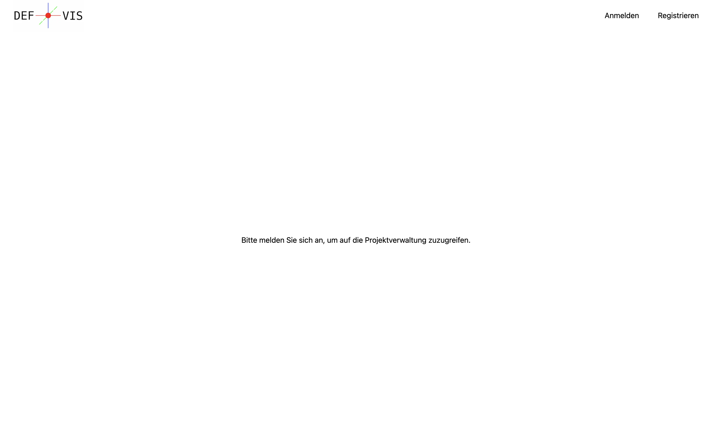

# Home

## Beschreibung

Die Home-Ansicht ist die erste Seite, die geladen wird, wenn man die Web-App startet. Der Benutzer kann sich neu registrieren oder anmelden, um auf die Projektverwaltung zuzugreifen.

## Buttons

Die Seite enthält drei Buttons und keine weiteren Interaktionen:

- **Home-Button:** Leitet den Benutzer zurück zur Home-Ansicht.
- **Login:** Ermöglicht es dem Benutzer, sich über das Login-Menü anzumelden, um auf die Projektverwaltung und Hauptansicht zuzugreifen.
- **Registrieren:** Ermöglicht es dem Benutzer, sich über das Registrierungs-Menü zu registrieren.

## Probleme und Verbesserungsvorschläge

- Die Bedeutung des Home-Buttons sollte überprüft werden - welchen Zweck erfüllt er?
- Die Seite könnte visuell ansprechender gestaltet werden, möglicherweise durch Ändern des Hintergrunds.
- Der Text könnte verbessert werden, zum Beispiel durch die Formulierung "Registrieren Sie sich oder melden Sie sich an, um auf die Projektverwaltung zuzugreifen."
- Möglicherweise sollte der Button "Registrieren" in "Registrieren" umbenannt werden.
