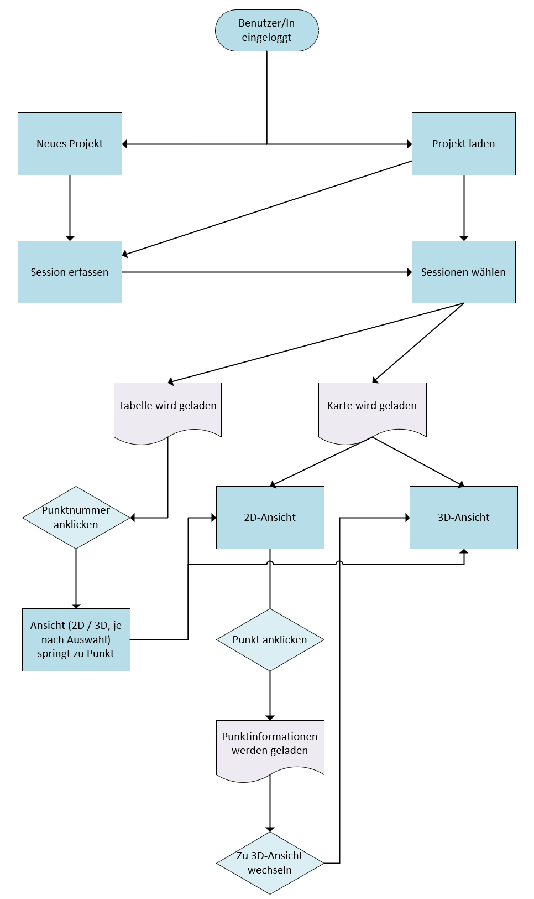

# DEFVIS Wiki

<video controls autoplay loop style="max-width: 100%; box-shadow: 0 0 5px rgba(0, 0, 0, 0.3);">
<source src="./videos/teaser.mp4" type="video/mp4">
Your browser does not support the video tag.
</video>

DEFVIS ist Deine Lösung für die Visualisierung und Analyse von Messdaten aus Deformationen. DEFVIS bietet Dir die Tools, die Du brauchst, um Deformationsdaten besser zu verstehen und fundierte Entscheidungen zu treffen.

## Überblick der Web-App DEFVIS

Die Web-App **DEFVIS** bietet Dir folgende Tools:

- **Deformationsmessungen verwalten**: Verwalte und analysiere Deformationsdaten effizient durch intuitive Eingabemasken und Projektübersichten.
- **Dreidimensionale Verschiebungen visualisieren**: Visualisiere die Bewegungen von Punkten in 3D, um geophysikalische Veränderungen besser zu verstehen.
- **Wirkungsvolle Überwachung und Analyse**: Überwache geophysikalische Veränderungen kontinuierlich und analysiere die Daten, um fundierte Entscheidungen zu treffen.

### Grafische Übersicht der implementierten und geplanten Features

| Feature                      | Status        | Beschreibung                                                                                                                                            |
| ---------------------------- | ------------- | ------------------------------------------------------------------------------------------------------------------------------------------------------- |
| Deformationsmessungen        | Implementiert | Verwalten von Messdaten, Hinzufügen neuer Sessions und Organisieren von Projekten.                                                                      |
| 3D-Visualisierung            | Implementiert | Darstellung von Verschiebungen in einer dreidimensionalen Ansicht, inklusive Fehlervektoren und detaillierten Punktinformationen.                       |
| Zeitreihenanalyse            | Geplant       | Zukünftige Erweiterung zur Verfolgung von Positionsänderungen über die Zeit, inklusive Berücksichtigung von Temperatur- und Wetterdaten.                |
| Farbcodierte Punkte          | Geplant       | Möglichkeit, Schwellwerte festzulegen und signifikante Bewegungen durch Farbcodierung hervorzuheben.                                                    |
| 2D-Balkendiagramme           | Geplant       | Ergänzung der 3D-Vektoren mit 2D-Balkendiagrammen, um Grössenverhältnisse und Bewegungen klarer zu visualisieren.                                       |
| Vollständige 3D-Karte        | Geplant       | Erstellung einer vollständigen 3D-Karte der Schweiz, vorbereitet durch einen FME-Prozess zur Optimierung der Auflösung und Kompression der Kartendaten. |
| Erweiterung des Sprachpakets | Geplant       | Einführung weiterer Sprachoptionen wie Englisch, Französisch und Italienisch, um eine breitere Nutzerbasis zu erreichen.                                |

Detailliertere Infos, was DEFVIS in Zukunft noch bieten wird, findest Du unter <a href="https://fabianruefenacht.github.io/DEFVIS/index.html#section6">Ausblick</a>.

ℹ️ Um die Web-App optimal zu nutzen, empfiehlt sich ein Laptop oder Desktopmonitor mit einer Mindestgrösse von 15 Zoll (38,1 cm).

---

## Wie wird die App installiert {#section1}

Hier gehts zur <a href="https://github.com/FabianRuefenacht/DEFVIS/?tab=readme-ov-file#schnellinstallation" target="_blank">Schnellinstallation</a>

---

## Entdecke die Features von DEFVIS {#section2}

Erkunde die Funktionen von DEFVIS. Weitere Informationen und detaillierte Anleitungen zu den Funktionen findest Du alles im <a href="https://fabianruefenacht.github.io/DEFVIS/index.html#section3">Benutzerhandbuch</a>.

Um einen besseren Überblich über den Arbeitsablauf und die Möglichkeiten zu bekommen, kannst Du den Arbeitsablauf in der nachfolgenden Grafik studieren.

Nachdem Du Dich angemeldet hat, kannst Du entweder ein neues Projekt erstellen oder ein bestehendes Projekt öffnen. Anschliessend kann eine Session erfasst werden. Wenn dies nicht gewünscht ist, kannst Du zwei Sessionen (Nullmessung und Folgemessung) auswählen. Die Tabelle mit den Verschiebungen und die 2D-Karte wird geladen. Wenn Du in der Tabelle auf die Punktnummer klickst, springt die Ansicht automatisch zum gewählten Punkt. Diese Option funktioniert sowohl in der Karte als auch im 3D-Modell. In der Karte kannst Du die Messpunkte betrachten. Das Symbol unten rechts in der Karte öffnet die Legende. Mit Klick auf einen Punkt werden die Informationen angezeigt. In den Informationen findest Du einen Knopf, welcher dich automatisch zum 3D-Modell weiterleitet. Dieses ist direkt auf den gewählten Punkt zentriert. In der 3D-Ansicht kannst du die Punkte mit Bezug zum Höhenmodell betrachten. Die Vektoren werden für jede Dimension (E, N, h) seperat dargestellt.

### 3D-Ansicht

<video controls autoplay muted loop style="max-width: 100%; box-shadow: 0 0 5px rgba(0, 0, 0, 0.3);">
<source src="./videos/3D.mp4" type="video/mp4">
Your browser does not support the video tag.
</video>

Unsere App bietet eine breite Palette von Funktionen, die Dir vielfältige Möglichkeiten bieten. Eine herausragende Funktion ist der 3D-Viewer, der es Dir ermöglicht, Fehlervektoren in einer dreidimensionalen Ansicht zu betrachten. Durch diese Darstellung in Bezug auf das Gelände kannst Du nicht nur 2D-Informationen erhalten, sondern auch den Fehlervektor im Kontext einer Oberfläche visualisieren. Dies ermöglicht es Dir, einen direkten Bezug herzustellen, beispielsweise um zu sehen, wie ein Punkt am Hang abrutscht.

### 2D-Ansicht

<video controls autoplay muted loop style="max-width: 100%; box-shadow: 0 0 5px rgba(0, 0, 0, 0.3);">
<source src="./videos/2D.mp4" type="video/mp4">
Your browser does not support the video tag.
</video>

In der 2D-Ansicht kannst Du die Punkte, die Du in Dein Projekt importiert hast, visualisieren. Der Fehlervektor wird angezeigt, sodass Du weisst, wie stark sich ein Punkt in welche Richtung bewegt.

### Punktinformationen

<video controls autoplay muted loop style="max-width: 100%; box-shadow: 0 0 5px rgba(0, 0, 0, 0.3);">
<source src="./videos/punktinfo.mp4" type="video/mp4">
Your browser does not support the video tag.
</video>

Um die Daten nicht nur visuell zu haben, sondern auch in einer Tabelle, werden aus den Daten der importierten Sessionen die Fehlervektoren in Ost-, Nord-Richtung und Höhe berechnet und in die Tabelle geschrieben. Durch Anklicken eines Punktes zoomst Du automatisch auf den Punkt in der Ansicht.

---

## Benutzerhandbuch {#section3}

Entdecke die vielfältigen Tools und Funktionen, die DEFVIS bietet. Klicke auf die Links unten, um zu den einzelnen Seiten zu gelangen und mehr über ihre Funktionen zu erfahren:

| ---------------------------------------------- | --------------------------------------------------------------------------------------------- |
| **[Home](home.html):** | Dies ist die Startseite der App.  |
| **[Benutzerverwaltung](user.html):** | Hier wird erklärt, wie Du ein Benutzerkonto erstellst, Dich an- und abmeldest. |
| **[Menü](main_view.html):** | Dies ist die zentrale Ansicht Deiner App, in der Du Projekte verwalten und Daten visualisieren kannst. |
| **[Projektverwaltung](projektverwaltung.html):** | Hier erfährst Du alles über die Projektverwaltung und wie Du Sessionen erfasst. |
| **[Ansichten](current_project.html):**| Sehe die Daten in Deinem ausgewählten Projekt ein. |

---

## Ausblick von DEFVIS {#section6}

In diesem Kapitel werden zukünftige Erweiterungen und Verbesserungen, die DEFVIS optimierter und benutzerfreundlicher machen könnten, erläutert. Diese möglichen Entwicklungen zielen darauf ab, die Funktionalität der App zu erweitern. Von der Einführung fortgeschrittener Analysetools über visuelle Verbesserungen bis hin zur sprachlichen Vielfalt gibt es zahlreiche Ideen, die DEFVIS in der Zukunft bereichern könnten.

### Zeitreihenanalyse

Die Einbindung einer Zeitreihenanalyse würde den Benutzenden ermöglichen, Positionsänderungen im Laufe der Zeit genauer zu verfolgen. Dies könnte durch die Berücksichtigung von Temperaturänderungen oder anderen meteorologischen Einflüssen geschehen. Bereits jetzt wird bei <a href="https://fabianruefenacht.github.io/DEFVIS/projektverwaltung.html#erfassen">Session erfassen</a> ein Zeitstempel erfasst, sodass man diese Information einer Session zuweisen und somit in einer Zeitreihenanalyse darstellen könnte. Wenn ein Punkt ausgewählt ist, kann durch das Klicken des Zeitreihenanalyse-Buttons die Zeitreihenanalyse mit den dazugehörigen Punktinformationen geladen werden.

### Farbcodierte Punkte

Eine weitere geplante Erweiterung ist, dass Nutzende einen oder mehrere Schwellwerte eingeben können. Die Punkte und Verschiebungen könnten dann farblich codiert werden.

### 2D-Balkendiagramme neben 3D-Vektoren (Billboards)

Die Grössen von Vektoren im dreidimensionalen Raum sind aufgrund von Perspektive und Entfernung schwer vergleichbar. Um dieses Problem zu mildern, könnte ein 2D-Balkendiagramm neben den Vektoren angezeigt werden. Dies könnte den Benutzern helfen, die Grössenverhältnisse besser einzuschätzen, da die 2D-Darstellung unabhängig von der Perspektive ist.

Allerdings hat die Verwendung von 2D-Balkendiagrammen auch ihre Einschränkungen. Die dreidimensionalen Elemente der Visualisierung werden je nach Perspektive unterschiedlich wahrgenommen und interpretiert. Ein Ansatz, der sich bewährt hat, basiert auf dem Paper "3D Geovisualization – Definition and Structures for the Assessment of Usefulness" von S. Bleisch. Laut Bleisch ist es wichtig, sowohl die dreidimensionale Darstellung als auch zusätzliche 2D-Informationen zu nutzen, um die Nützlichkeit und Verständlichkeit zu erhöhen.

In diesem Kontext könnte eine kombinierte Visualisierungsstrategie verfolgt werden, bei der:

**2D-Balkendiagramme** als Ergänzung zu den 3D-Vektoren dienen, um die relative Grösse der Vektoren auf eine für den Benutzenden leicht verständliche Weise darzustellen.
**Interaktive Elemente** implementiert werden, die es ermöglichen, zwischen verschiedenen Perspektiven zu wechseln oder die Vektoren dynamisch zu untersuchen.
**Zusätzliche Beschriftungen und Hilfsmittel** wie Massstabsleisten oder Kontextinformationen eingeblendet werden, um die Wahrnehmung und Interpretation der 3D-Elemente zu verbessern.

Durch diese Kombination aus 3D-Darstellung und unterstützenden 2D-Visualisierungen wird die Benutzerfreundlichkeit und Genauigkeit der Grösseninterpretation erhöht. Diese Vorgehensweise orientiert sich an den Empfehlungen aus der wissenschaftlichen Literatur und verbessert die Gesamtqualität der geovisualisierten Daten.

### Vollständige 3D-Karte der Schweiz

Die Erstellung einer vollständigen 3D-Karte der Schweiz stellt uns vor einige Herausforderungen. Derzeit verwenden wir [qgis2threejs](https://plugins.qgis.org/plugins/Qgis2threejs/), das jedoch nur kleine Ausschnitte in hoher Qualität unterstützt. Um die gesamte Karte in hoher Auflösung und guter Qualität darstellen zu können, ist ein effizienterer Ansatz erforderlich.

Ein möglicher Ansatz wäre, die 3D-Karte zukünftig durch einen FME-Prozess (Feature Manipulation Engine) vorzubereiten und anschliessend zu komprimieren. Der FME-Prozess bietet leistungsstarke Werkzeuge zur Verarbeitung und Transformation von Geodaten, die es ermöglichen, die Auflösung der Karte zu optimieren und die Kartendaten effizient zu komprimieren.

Sobald ein geeigneter Workflow für diesen Prozess entwickelt ist, könnte die 3D-Karte schrittweise auf die gesamte Schweiz ausgeweitet werden. Dabei ist es wichtig, sowohl die Datenqualität als auch die Performance zu berücksichtigen, um eine flüssige und präzise Visualisierung zu gewährleisten.

Durch die Implementierung dieses optimierten Prozesses wird es möglich sein, umfassende und detaillierte 3D-Karten der Schweiz bereitzustellen, die für verschiedenste Anwendungen und Analysen genutzt werden können.

Ich hoffe, dieser überarbeitete Abschnitt hilft Ihnen, Ihre App weiter zu verbessern und die Herausforderungen bei der Erstellung einer vollständigen 3D-Karte der Schweiz zu meistern.

### Erweiterung des Sprachpakets

Die App DEFVIS ist derzeit nur auf Deutsch verfügbar. Zukünftig wäre es sinnvoll, die Web-App in mehreren Sprachen anzubieten, darunter Englisch, Französisch und Italienisch, um eine breitere Nutzerbasis anzusprechen und die Benutzerfreundlichkeit zu verbessern. Dies würde es internationalen Nutzern ermöglichen, die App in ihrer bevorzugten Sprache zu nutzen, was die Zugänglichkeit und Akzeptanz erheblich steigern könnte.

### Darstellung und Beschriftung der Vektoren/Punkte in der 3D-Ansicht

<table style="width: 100%;">
  <tr>
    <td style="width: 50%; vertical-align: top;">
      

        
        
Screenshot aus der App mit 3D-Ansicht von "oben": Bei einigen Punkten sind nicht alle Fehlervektoren sichtbar

      

    </td>
    <td style="width: 50%; vertical-align: top;">
      

        
        
Screenshot aus der App mit 3D-Ansicht von "unten": Punkte mitsamt Vektoren werden unter der Karte erst angezeigt.

      

    </td>
  </tr>
</table>

In der 3D-Ansicht werden die Vektoren nicht vollständig sichtbar gerendert. Das Problem besteht darin, dass die Vektoren teilweise im Modell verschwinden, was es dem Betrachter erschwert, die Daten korrekt zu interpretieren. Ein möglicher Lösungsansatz wäre, die Karte mit einer gewissen Transparenz zu versehen, sodass auch die Vektoren, die im Modell verschwinden, sichtbar bleiben. Derzeit ist diese Umsetzung jedoch nicht sinnvoll, da zunächst ein korrektes Modell gerendert werden muss, bei dem die Modellparameter genau bestimmt werden können.

Um die Punkte besser identifizieren zu können, sollte zudem eine Beschriftung im 3D-Modell für die jeweiligen Punkte dargestellt werden.

---

[zurück nach ganz oben](index.html)
