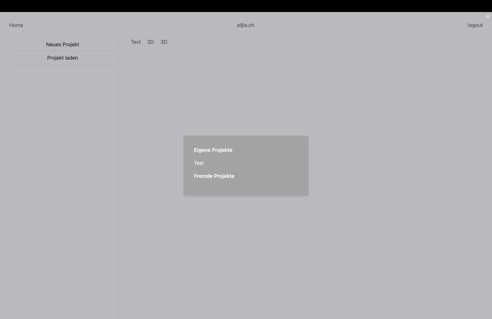

# Projekt laden

## Probleme und Verbesserungsvorschläge

- Projekte werden nicht übereinander, sondern nebeneinander aufgelistet, was die Übersichtlichkeit beeinträchtigen kann.
- Es könnte sinnvoll sein, die Projekte chronologisch statt alphabetisch zu ordnen, um die Suche nach bestimmten Projekten zu erleichtern.
- Es gibt keine Möglichkeit, das Fenster einfach zu schliessen. Ein deutlicherer Schliessen-Button, vielleicht oben rechts platziert, könnte die Benutzerfreundlichkeit verbessern.
