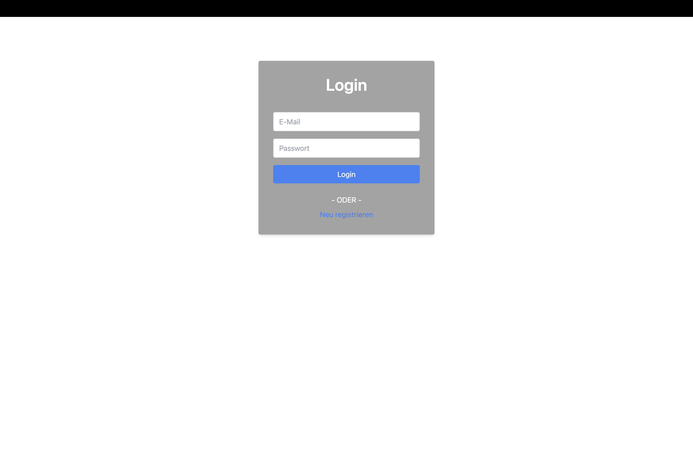

# Login

## Beschreibung

Auf der Login-Seite kann sich ein Benutzer über einen bereits registrierten Account anmelden. Wenn der Benutzername nicht gefunden wird oder das Passwort falsch ist, wird der Benutzer darüber informiert.

## Buttons und Eingaben

Die Seite enthält 2 Buttons und 2 Texteingaben:

- **Login:** Ermöglicht es dem Benutzer, sich über das Login-Menü anzumelden, um auf die Projektverwaltung und Hauptansicht zuzugreifen.
- **Neu Registrieren:** Leitet den Benutzer zur Register-Seite weiter.

## Probleme und Verbesserungsvorschläge

- Die Warnmeldungen sollten angepasst werden:
  - "Dieser Benutzername wurde nicht gefunden" (für falschen Benutzernamen)
  - "Falsches Passwort. Bitte versuchen Sie es erneut oder klicken Sie auf 'Passwort vergessen', um das Passwort zurückzusetzen."
    Die Schrift und die Umrandung der Textfelder (für Benutzername und Passwort) könnten rot gemacht werden, um Warnungen zu kennzeichnen.
- Möglicherweise könnte ein Home-Button hinzugefügt werden, um zurück zur Home-Ansicht zu gelangen.
- Das Login-Feld könnte zentriert werden, um die Benutzerfreundlichkeit zu verbessern.
