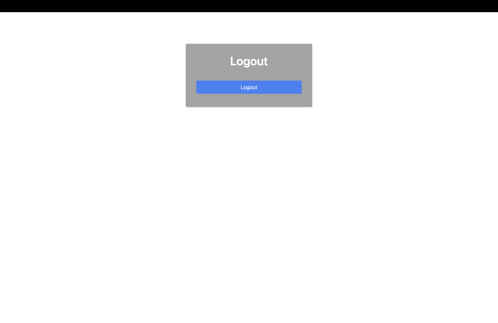

[Gehe zurück zur Hauptseite](index.md)

# Logout

## Probleme und Verbesserungsvorschläge

- Eventuell könnte ein zusätzlicher Link hinzugefügt werden: "Zurück zur App", um den Benutzern eine einfache Möglichkeit zu bieten, zur Hauptansicht der App zurückzukehren.

<a href="current_project.html">< Gehe zurück zur vorherigen Seite</a>

