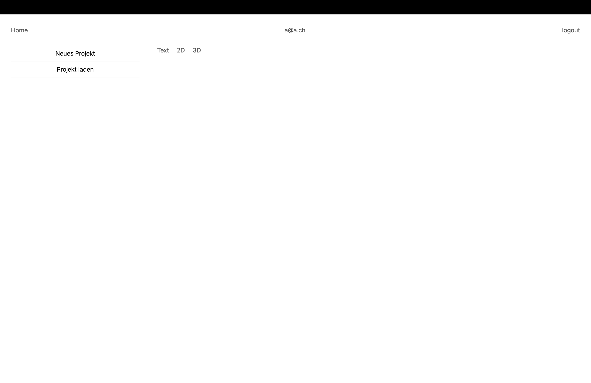

# Hauptansicht

## Beschreibung

In der Hauptansicht kann der Benutzer Projekte verwalten und einsehen, d.h. die Daten auf einer Karte anzeigen lassen.

## Buttons

Die Seite enthält 7 Buttons:

- **Home:** Leitet den Benutzer zurück zur Home-Ansicht.
- **Logout:** Ermöglicht es dem Benutzer, sich abzumelden.
- **Neues Projekt:** Ermöglicht es dem Benutzer, ein neues Projekt zu erstellen.
- **Projekt laden:** Ermöglicht es dem Benutzer, ein bereits erfasstes Projekt zu laden.
- **Text:** Zeigt die Koordinaten im ausgewählten Projekt an.
- **2D:** Zeigt eine 2D-Ansicht des ausgewählten Projekts.
- **3D:** Zeigt eine 3D-Ansicht des ausgewählten Projekts.

## Probleme und Verbesserungsvorschläge

- Der Home-Button hat derzeit keine sinnvolle Funktion. Möglicherweise sollte überlegt werden, ob er entfernt oder mit einer Funktion versehen werden sollte.
- Es könnte sinnvoll sein, die Buttons "Text", "2D" und "3D" erst sichtbar zu machen, wenn ein Projekt geladen wurde, um die Benutzererfahrung zu verbessern.
- Um dem Benutzer mehr Kontext zu geben, könnte eine 2D-Karte der Schweiz eingebunden werden und ein Text wie "Laden oder erstellen Sie ein Projekt" angezeigt werden.
