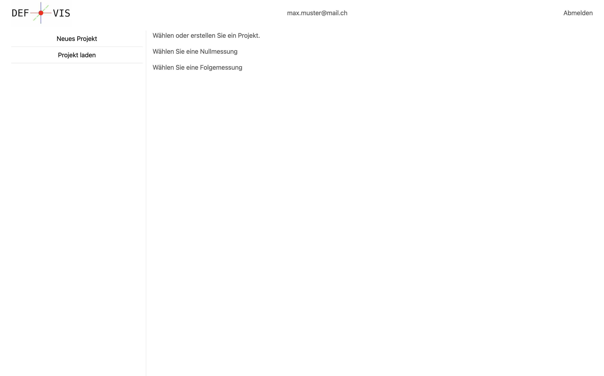

[Gehe zurück zur Hauptseite](index.html)

# Menü

## Beschreibung

Als registrierte\*r Benutzer\*in wirst Du beim Anmelden direkt auf die Hauptseite der App weitergeleitet. Dort findest Du das Menü auf der linken Seite. Um Deine Projekte zu verwalten und sie auf einer Karte anzuzeigen, folge diesen nächsten Schritten.

1. Wähle oder erstelle ein Projekt
2. Wähle die Nullmessung aus
3. Wähle die Folgemessung aus

## Funktionen

Die Seite enthält drei Buttons:

- **Neues Projekt:** Ermöglicht es dem Benutzenden, ein neues Projekt zu erstellen.
- **Projekt laden:** Ermöglicht es dem Benutzenden, ein bereits erfasstes Projekt zu laden, um dieses zu bearbeiten oder einzusehen.
- **Abmelden:** Ermöglicht es dem Benutzenden, sich abzumelden.

---

**Probleme und Verbesserungsvorschläge**

- _ändern der Schritt für Schritt anleitung von "Sie" zu "Du"._

<a href="user.html">< Benutzerverwaltung</a>

<a href="projektverwaltung.html">Projektverwaltung ></a>

