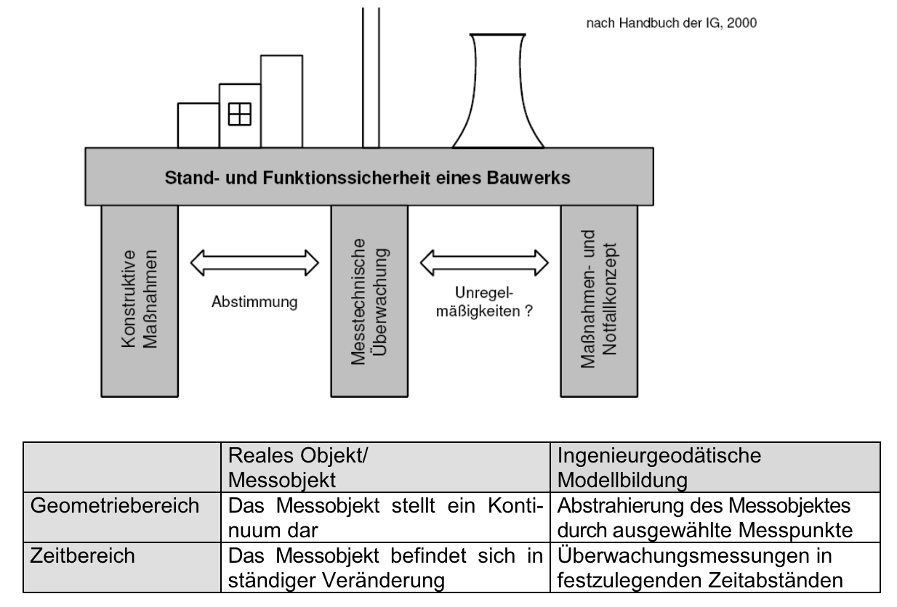

[Gehe zurück zur Hauptseite.](index.html)

# Angewandte Methoden

<ul>
<li><a href="https://fabianruefenacht.github.io/DEFVIS/methoden.html#prozess">Prozess der Deformationsmessung</a></li>
<li><a href="https://fabianruefenacht.github.io/DEFVIS/methoden.html#herausforderung">Herausforderung bei der Interpretation und Kontrolle</a></li>
<li><a href="https://fabianruefenacht.github.io/DEFVIS/methoden.html#unterstuetzung">Unterstützung durch DEFVIS</a></li>
<li><a href="https://fabianruefenacht.github.io/DEFVIS/methoden.html#literatur">Literatur</a></li>
</ul>

---

Deformationsmessungen sind ein wesentlicher Bestandteil der Ingenieurvermessung und Geodäsie. Ziel ist es, die Verschiebung von Überwachungspunkten im Verhältnis zu stabilen Referenzpunkten zu bestimmen. Dabei kommen verschiedene Vermessungsmethoden zum Einsatz, darunter:

- **Nivellement**
- **Triangulation**
- **Distanzmessung**
- **Lotung**
- **Inklinometer**
- **GNSS (Global Navigation Satellite System)**

---

## Prozess der Deformationsmessung {#prozess}

(1.) **Datenerfassung**:

- **Nivellement**: Präzise Höhenmessung zur Erfassung von Höhenunterschieden.
- **Triangulation**: Bestimmung von Positionen durch Winkelmessungen in einem Netz von Punkten.
- **Distanzmessung**: Ermittlung von Entfernungen zwischen Punkten mittels elektronischer Distanzmessgeräte (Tachymeter).
- **Lotung**: Vertikale Abweichungsmessung von der Lotrichtung.
- **Inklinometer**: Messung von Neigungswinkeln zur Bestimmung von Verschiebungen in Strukturen.
- **GNSS**: Globale Positionsbestimmung mittels Satellitensignalen.

(2.) **Datenverarbeitung**:
Die beobachteten Messgrössen werden mit der Methode der kleinsten Quadrate in einer geodätischen Ausgleichung verarbeitet, um präzise Koordinaten zu berechnen.

**Formel der Methode der kleinsten Quadrate**:

$$
X = (A^T P A)^{-1} A^T P L
$$

- `X`: Vektor der Unbekannten (Koordinaten)
- `A`: Designmatrix
- `P`: Gewichtsmatrix
- `L`: Beobachtungsvektor

(3.) **Analyse und Interpretation**:
Die berechneten Koordinaten werden statistisch analysiert, um signifikante Deformationsvektoren zu bestimmen. Dies geschieht durch den Vergleich von Messungen aus verschiedenen Zeitpunkten.

**Literaturangaben**:

- Niemeier, W. (2008). Ausgleichungsrechnung: Statistische Auswertemethoden. Walter de Gruyter.
- Ghilani, C. D. (2017). Adjustment Computations: Spatial Data Analysis. John Wiley & Sons.

---

## Herausforderungen bei der Interpretation und Kontrolle {#herausforderung}

**Die Interpretation und Kontrolle der Deformationsvektoren sind anspruchsvoll, da:**

- Gute Kenntnisse über die Orientierung des Koordinatensystems erforderlich sind.
- Numerische Werte allein schwer zu interpretieren sind.

**Die dreidimensionale Visualisierung der Deformationsvektoren auf einem Geländemodell erleichtert diese Aufgaben erheblich, indem sie:**

- Eine intuitive Darstellung der Verschiebungen ermöglicht.
- Eine schnellere Erkennung von Mustern und Anomalien erlaubt.
- Die Kommunikation der Ergebnisse zwischen geodätischen und geologischen Fachpersonen verbessert.

---

## Unterstützung durch DEFVIS {#unterstuetzung}

Das Tool DEFVIS unterstützt die Nutzenden im gesamten Prozess der Deformationsmessung:

- **Datenintegration**: Verschiedene Vermessungsmethoden können in das System integriert werden.
- **Automatisierte Berechnungen**: Die Methode der kleinsten Quadrate wird automatisch angewendet, um genaue Koordinaten zu berechnen.
- **3D-Visualisierung**: Die Ergebnisse werden auf einem dreidimensionalen Geländemodell dargestellt, was die Interpretation und Kontrolle der Deformationsvektoren vereinfacht.

**Illustration der Prozesse**:

https://tu-dresden.de/bu/umwelt/geo/gi/ig/ressourcen/dateien/lehrveranstaltungen/geodaesie/master_ig/BauWerkUeberw.pdf?lang=de [22. Mai 2024]

Die Illustration veranschaulicht den Prozess der messtechnischen Überwachung. Durch die Integration verschiedener Ansichten, insbesondere der 3D-Ansicht, bietet DEFVIS eine benutzerfreundliche Plattform, die die Komplexität der Deformationsmessung und -interpretation reduziert. Diese Integration ermöglicht es den Anwendern, bereits nach wenigen Messungen zu beurteilen, ob konstruktive Massnahmen erforderlich sind oder Massnahmen- und Notfallkonzepte. Somit wird auch der wirtschaftliche Aspekt dabei berücksichtigt. Im Vergleich zu einer Beurteilung in einer 2D-Ansicht kann mit der 3D-Ansicht von DEFVIS ein Bezug zum Höhenmodell erstellt werden. So ist etwa gut sichtbar, ob sich ein Punkt durch natürliche Einflüsse oder durch sonstige Einflüsse bewegt.

---

## Literatur {#literatur}

Ausgleichungsrechnung und Vermessungstechniken:

Niemeier, W. (2008). Ausgleichungsrechnung: Statistische Auswertemethoden. Walter de Gruyter. ISBN: 978-3110194642.
Ghilani, C. D. (2017). Adjustment Computations: Spatial Data Analysis. John Wiley & Sons. ISBN: 978-1119385983.
Geodätische Messverfahren:

Wolf, P. R., & Ghilani, C. D. (2014). Elementary Surveying: An Introduction to Geomatics. Pearson. ISBN: 978-0133758887.
Torge, W., & Müller, J. (2012). Geodesy. Walter de Gruyter. ISBN: 978-3110207182.
Deformationsmessung und -analyse:

Caspary, W. F. (2000). Concepts of Network and Deformation Analysis. Taylor & Francis. ISBN: 978-0203476213.
Kasser, M., & Egels, Y. (2002). Digital Photogrammetry. Taylor & Francis. ISBN: 978-0748409929.
GNSS-Messmethoden:

Hofmann-Wellenhof, B., Lichtenegger, H., & Wasle, E. (2008). GNSS – Global Navigation Satellite Systems: GPS, GLONASS, Galileo, and more. Springer. ISBN: 978-3211730126.
Misra, P., & Enge, P. (2006). Global Positioning System: Signals, Measurements, and Performance. Ganga-Jamuna Press. ISBN: 978-0970954428.
Ingenieurgeodäsie und Visualisierung:

Vanicek, P., & Krakiwsky, E. J. (1986). Geodesy: The Concepts. North Holland. ISBN: 978-0444875284.
Longley, P. A., Goodchild, M. F., Maguire, D. J., & Rhind, D. W. (2015). Geographic Information Systems and Science. John Wiley & Sons. ISBN: 978-1118676952.

---

[Zurück nach ganz oben.](methoden.html)
