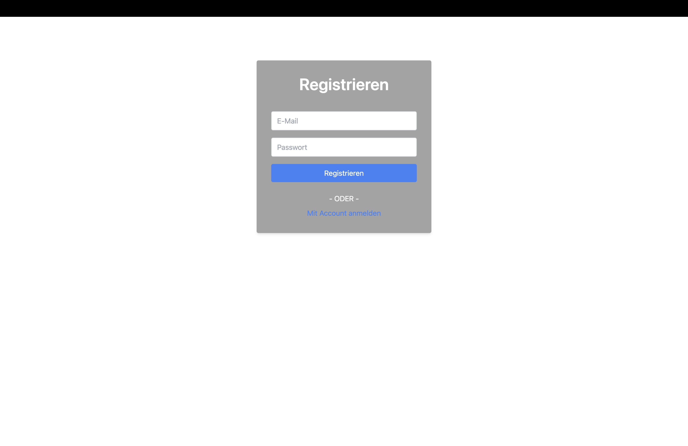

# Register

## Beschreibung

Auf der Register-Seite kann sich ein Benutzer registrieren. Wenn der Benutzername bereits existiert oder die Textformatierung nicht korrekt ist, wird der Benutzer darüber informiert.

## Buttons und Eingaben

Die Seite enthält 2 Buttons und 2 Texteingaben:

- **Registrieren:** Ermöglicht es dem Benutzer, sich über das Register-Menü zu registrieren, um auf die Projektverwaltung und Hauptansicht zuzugreifen.
- **Mit Account anmelden:** Leitet den Benutzer zur Login-Seite weiter.

## Probleme und Verbesserungsvorschläge

- Es sollte überlegt werden, ob der Benutzer nach dem Registrieren direkt zur Hauptansicht weitergeleitet werden soll.
- Der Text "User existiert bereits" könnte verbessert werden, z.B. als "<i>info</i> User existiert bereits", und die Farbe könnte auf rot geändert werden, um Warnungen hervorzuheben.
- Möglicherweise könnte das Register-Fenster zentriert werden, um die Ästhetik zu verbessern.
